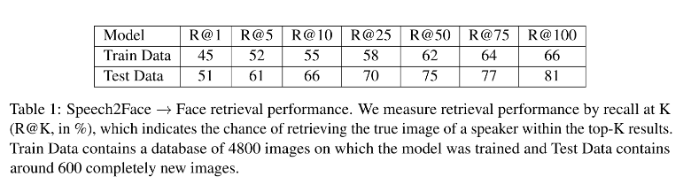
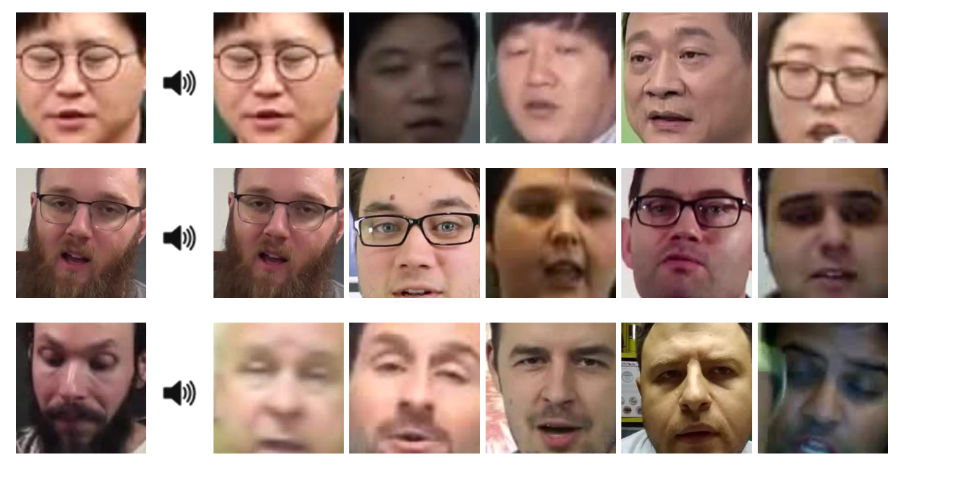

# Speech2Face

This project implements a framework to convert speech to facial features as described in the CVPR 2019 paper - [Speech2Face: Learning the Face Behind a Voice](https://arxiv.org/pdf/1905.09773.pdf) by MIT CSAIL group.

### Steps Used
1.Creating a model for reconstructing a person's face from his/her voice sample.
2.The project started off with understanding the workflow and creating a timeline of the tasks to be done.
3.Firstly, I extracted the voice segments and face of the people from youtube videos using the AVSpeech dataset.
4.Next, I augmented the audio segments with themselves until they reached a fixed clip size to make the inputs uniform for the encoder network.
5.After that, I extracted the facial features from the extracted faces using VGG vace which would be the output ground truth values for my encoder network and proceeded with building and training the encoder network.
6.The next task was to reconstruct the image of a person from the output of the encoder using a Face decoder network.
7.I built the decoder network to do the same usign transpose convolution layers and sm currently in the process of optimization of hyper-parameters.
9.In the end, I was able to create a model that can give an approximate of a person's facial looks from his / her audio samples

### Getting Started

1. Go to preprocess folder and run `prepare_directory.sh` and then download AVSpeech Dataset. Run `data_download.py` file for data download from youtube based on AVSpeech Dataset.
```
cd preprocess/
sh prepare_directory.sh
```
Download [AVSpeech Dataset](https://looking-to-listen.github.io/avspeech/download.html) in the folder.
```
python3 data_download.py
usage: data_download.py [-h] [--from_id FROM_ID] [--to_id TO_ID]
                        [--low_memory LOW_MEMORY] [--sample_rate SAMPLE_RATE]
                        [--duration DURATION] [--fps FPS] [--mono MONO]
                        [--window WINDOW] [--stride STRIDE]
                        [--fft_length FFT_LENGTH] [--amp_norm AMP_NORM]
                        [--face_extraction_model FACE_EXTRACTION_MODEL]
                        [--verbose]
```
2. Now run the base file with train option if you want to train.
```
python3 base.py
usage: base.py [-h] [--from_id FROM_ID] [--to_id TO_ID] [--epochs EPOCHS]
               [--start_epoch START_EPOCH] [--batchsize BATCHSIZE]
               [--num_gpu NUM_GPU] [--num_samples NUM_SAMPLES]
               [--load_model LOAD_MODEL] [--save_model SAVE_MODEL] [--train]
               [--verbose]
```

## Results
We have used face retrieval performace as a evaluation metric and we are able to achieve a decent accuracy. Increasing the computation power and using complete dataset can help us achieve greater accuracy.

<p align="center">
    
</p>
<p align="center">
    
</p>

## License
This project is licensed under the MIT License - see the [LICENSE](LICENSE) file for details.

## References
1. Speech2Face: Learning the Face Behind a Voice (https://arxiv.org/pdf/1905.09773.pdf)
2. Wav2Pix: Speech-conditioned face generation using generative adversarial networks (https://arxiv.org/pdf/1903.10195.pdf)
3. AVSpeech Dataset (https://looking-to-listen.github.io/avspeech/download.html)
